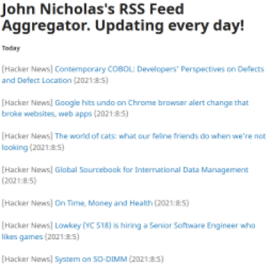

# rPi-RSS
Hello! This repository holds the code for the Raspberry Pi-powered [RSS aggregator](https://johngnicholas.github.io/rss_feed/feed.html) on my [website](https://johngnicholas.github.io), as well as instructions on how to set up your own using [Github Pages](https://pages.github.com/)! I made this project to strengthen my Python skills and learn more about RSS, Git, and HTML.

This project requires [feedparser](https://github.com/kurtmckee/feedparser) and [BeautifulSoup](https://www.crummy.com/software/BeautifulSoup/). These packages are open-source and freely available in package managers such as [PyPi](https://pypi.org/) and [Conda](https://conda.io).

Here is a screenshot of the RSS aggregator in action:

# Build instructions
(These instructions will be updated to be easier to follow in the future)

Obtain a Raspberry Pi or other Linux machine to host the aggregator. Set a strong password! Security is for everyone!

Set up a website with Github Pages to host the aggregated content.

Clone your website repository to your Raspberry Pi. It will work best if this is simply cloned to /home/pi/Documents

Set up a [Github SSH key](https://docs.github.com/en/github/authenticating-to-github/connecting-to-github-with-ssh) for the repository on the aggregator machine to enable it to automatically push to Github.

Clone the rPi-RSS repository to into the parent directory of the website directory on your Raspberry Pi.

Modify the content of feedList.txt to contain the URL addresses for the RSS feeds you wish to subscribe to.

Modify the feedTemplate.html file to your desired HTML header and add any content to the body you wish to appear "above the fold".

Copy the modified feedTemplate.html file to your website using the command: cp feedTemplate.html ../<your_website_name.github.io>/rss_feed/feedTemplate.html

Modify the update_rss_feed.sh file to include the appropriate file paths to your rPi-RSS and website directories on your Raspberry Pi.

Modify the crontab_template.txt file to include the appropriate file paths to your rPi-RSS directory.

Copy the contents of the crontab_template.txt file into your cron file with the command crontab -e

If you wish to aggregate by feed instead of by date, modify the update_rss_feed.sh file to call client.py instead of clientRecent.py
